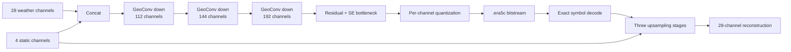

# ERA5 Weather Codec

Сжатие 28-канального состояния нижней атмосферы ERA5 с фактическим
compression ratio не ниже `32×`.

Решение использует один свёрточный автоэнкодер, дискретное латентное
представление и настоящий сериализованный `.era5c` bitstream. Полный
воспроизводимый запуск опубликован на Kaggle:

**[Nuclear IT Hack — solution notebook](https://www.kaggle.com/code/daniilkrasnovvv/nuclear-it-hack-untitled-0-solution)**

Числа в этом README взяты из успешного запуска версии 3/3.

## Результат

Модель обучена на `N=256` уникальных погодных состояниях. Финальная оценка
выполнена на 16 тестовых кадрах 2021 года после выбора checkpoint и
калибровки только на validation 2020 года.

| Метрика | Значение |
|---|---:|
| Общий score, `S_all` | **0.166056** |
| Surface NRMSE | **0.203070** |
| Pressure NRMSE | **0.129042** |
| Mean PSNR | **31.820 dB** |
| Spectral error | **0.036391** |
| Средний compression ratio | **33.167×** |
| Минимальный compression ratio | **32.966×** |
| Запас относительно 32× | **3.647%** |
| Extreme precipitation RMSE | **9.766 мм** |
| Extreme precipitation F1 | **0.691** |
| Exact latent roundtrip | **True** |
| Критерии natural variability | **8/8, PASS** |

Целевое ограничение `CR ≥ 32×` выполнено на каждом тестовом кадре, а не
только в среднем.

## Постановка

Один временной срез имеет форму:

```text
28 × 360 × 720
```

Это глобальная сетка ERA5 с разрешением `0.5°`. Модель совместно кодирует
восемь приземных полей и двадцать полей на четырёх изобарических уровнях.

### Приземные поля

```text
t2m, mslp, u10, v10, tp6h, sst, tcwv, tcc
```

### Поля на уровнях 1000, 925, 850 и 700 hPa

```text
T1000, T925, T850, T700
U1000, U925, U850, U700
V1000, V925, V850, V700
Z1000, Z925, Z850, Z700
Q1000, Q925, Q850, Q700
```

Размер несжатого кадра определяется как размер `float32`-массива только с
28 динамическими каналами. Статические поля в числитель compression ratio не
включаются:

```text
original_bits = 28 × 360 × 720 × 32
compression_ratio = original_bits / serialized_bitstream_bits
```

## Данные

Ноутбук ожидает подготовленный Kaggle Dataset или Notebook Output:

```text
train.npy
val.npy
test.npy
train_pairs.npy
val_pairs.npy
static.npy
stats.npz
manifest.json
```

| Файл | Формат |
|---|---|
| `train.npy` | `float16`, `[N, 28, 360, 720]` |
| `val.npy` | `float16`, `[N_val, 28, 360, 720]` |
| `test.npy` | `float16`, `[N_test, 28, 360, 720]` |
| `static.npy` | `float32`, `[4, 360, 720]` |
| `train_pairs.npy` | пары кадров с шагом `+6 ч` |
| `val_pairs.npy` | validation-пары с шагом `+6 ч` |
| `stats.npz` | mean, std, physical std, квантили, координаты и ocean mask |
| `manifest.json` | временные метки и описание подготовки |

Используется временное разделение:

| Split | Период |
|---|---|
| Train | 2014–2019 |
| Validation | 2020 |
| Test | 2021 |

Test не участвует в выборе checkpoint или настройке степени сжатия.

Допустимые размеры обучающей выборки:

```text
N ∈ {128, 256, 512, 1024, 2048, 4096, 8192}
```

Опубликованный результат получен при `N=256`.

## Архитектура

Используется одна joint-модель для всех 28 погодных каналов.



### Географические свёртки

`GeoConv2d` использует:

- circular padding по долготе;
- reflect padding по широте.

Это сохраняет непрерывность глобального поля на границе `0°/360°` и уменьшает
искусственные краевые эффекты.

### Encoder

К 28 погодным каналам добавляются четыре статических поля. Три стадии со
stride 2 уменьшают пространственное разрешение в восемь раз:

```text
32 → 112 → 144 → 192 channels
360 × 720 → 45 × 90
```

Каждая стадия содержит residual-блоки с `GroupNorm`, depthwise-свёрткой
`5×5`, pointwise-свёртками, `SiLU` и обучаемым масштабом residual-ветви.
В bottleneck добавлен Squeeze-and-Excitation.

### Quantized latent

Для каждого из 192 латентных каналов обучается собственный масштаб:

```text
symbols = round(latent / channel_scale × gain)
```

Во время обучения градиент проходит через округление с помощью
straight-through estimator. Во время inference используются настоящие
целочисленные символы.

Параметр `gain` управляет rate–distortion компромиссом. В опубликованном
запуске validation-калибровка выбрала:

```text
gain = 170.823221
```

### Decoder

После обратного квантования слабая обучаемая проекция статических полей
добавляется в латент. Три стадии восстанавливают исходное разрешение.
Финальная residual refinement-сеть уточняет мелкомасштабные детали.

Модель содержит **3 389 222 параметра**.

## Настоящий bitstream

Решение измеряет не размер тензора латента, а полный сериализованный поток.

Пайплайн кодирования:

1. округление латентных значений до `int32`;
2. пространственное delta-преобразование;
3. ZigZag-кодирование знаковых значений в `uint32`;
4. сжатие `zlib/DEFLATE` с уровнем 9;
5. добавление JSON-заголовка.

Заголовок содержит версию формата, форму латента, `gain`, параметры entropy
coder и SHA-256 целочисленных символов.

При декодировании SHA-256 проверяется повторно. Поэтому `exact roundtrip`
означает точное совпадение дискретного латента до и после сериализации.
Реконструкция при этом остаётся lossy.

## Обучение

Модель обучается на случайных патчах `160×160`. Патчи, пересекающие границу
долгот, формируются циклически.

Функция потерь:

```text
L = L_reconstruction
  + 0.015 × L_gradient
  + 0.080 × L_precipitation
  + 0.010 × L_occupancy
```

Компоненты:

- `L_reconstruction` — latitude-weighted MSE;
- surface и pressure группы имеют одинаковый суммарный вес;
- ошибка `sst` считается только над океаном;
- `L_gradient` сохраняет пространственные границы;
- `L_precipitation` увеличивает вес сильных осадков;
- `L_occupancy` препятствует схлопыванию латента в нули.

Расписание квантизации:

| Этап | Gain |
|---|---:|
| Reconstruction warm-up, первые 2000 шагов | 8 |
| Основная 32× стадия | 40 |
| Quality anchor, каждый 10-й шаг | 50 |

Основные параметры:

| Параметр | Значение |
|---|---:|
| Optimizer | AdamW |
| Learning rate | `2e-4` |
| Weight decay | `1e-4` |
| LR warm-up | 600 шагов |
| Gradient clipping | `0.75` |
| Validation interval | 500 шагов |
| Early-stopping patience | 14 |
| P100 batch size | 2 |
| T4 batch size | 4 |
| P100 step limit | 12 000 |
| T4 step limit | 16 000 |

Checkpoint опубликованного решения содержит 12 000 optimizer steps,
24 000 обработанных примеров и `N=256` уникальных train-кадров.

Опубликованная версия повторно использовала собственный совместимый checkpoint
предыдущего запуска этого же решения. Внешнее погодное pretraining не
использовалось.

## Калибровка под 32×

После обучения модель фиксируется, а `gain` выбирается только по validation:

1. проверяются четыре validation-кадра;
2. выполняется coarse search по геометрической сетке;
3. допустимая область уточняется восемью шагами бисекции;
4. выбирается максимальный gain, сохраняющий минимальный validation CR не ниже
   `32 × 1.035`.

Запас `3.5%` компенсирует различия сложности кадров между validation и test.

## Метрики

Ошибки взвешиваются по широте. Для `sst` дополнительно применяется ocean mask.

Главный score:

```text
S_all = 0.5 × S_surface + 0.5 × S_pressure
```

NRMSE каждого поля определяется через train-only физическое стандартное
отклонение:

```text
NRMSE[channel] = latitude_weighted_RMSE[channel] / train_std[channel]
```

Также вычисляются:

- RMSE и PSNR для каждого канала;
- spectral error по сферическим гармоникам до `lmax=40`;
- RMSE `mslp`, `tp6h`, скорости ветра на 10 м и высоты `Z700`;
- precision, recall и F1 экстремальных осадков;
- фактический размер каждого bitstream;
- минимальный и средний compression ratio;
- exact latent roundtrip.

### Natural-variability проверка

Модель сравнивается с постоянным климатологическим baseline, построенным из
предоставленных mean и standard deviation ERA5. VAEformer в этой проверке не
используется.

| Критерий | Порог |
|---|---:|
| Upper 95% CI общего NRMSE | `≤ +3%` |
| Upper 95% CI surface score | `≤ +5%` |
| Upper 95% CI pressure score | `≤ +5%` |
| Худшее отдельное поле | `≤ +7%` |
| Lower 95% CI разности PSNR | `≥ −0.25 dB` |
| Upper 95% CI spectral degradation | `≤ +5%` |
| Compression ratio | `≥ 32×` |
| Exact roundtrip | обязательно |

В опубликованном test-run выполнены все восемь критериев.

## Latent forecast probe

Отдельный probe проверяет, содержит ли замороженный латент информацию,
полезную для прогноза на `+6 ч`.

| Параметр | Значение |
|---|---:|
| Train pairs | 1024 уникальные пары |
| Validation pairs | 32 |
| Test pairs | 32 |
| Параметры probe | 194 496 |
| Optimizer steps | 5000 |
| Best validation latent MSE | 0.000708 |
| Улучшение над persistence на validation | 20.019% |
| Улучшение над persistence на test | 19.029% |
| Статус | `evaluated_on_test_2021` |

Codec при обучении probe не изменяется. Результат показывает, что сжатое
представление сохраняет динамическую информацию, а не только позволяет
восстановить текущий кадр.

## Запуск на Kaggle

1. Откройте
   [опубликованный ноутбук](https://www.kaggle.com/code/daniilkrasnovvv/nuclear-it-hack-untitled-0-solution).
2. Нажмите **Copy & Edit**.
3. Подключите подготовленный dataset через **Add Input**.
4. Выберите один GPU — P100 или T4.
5. Для запуска на P100 включите Internet: при необходимости ноутбук установит
   PyTorch с поддержкой архитектуры `sm_60`.
6. Установите режим:

   ```python
   run_mode = "AUTO"       # загрузить checkpoint или обучить
   run_mode = "TRAIN"      # обучить заново
   run_mode = "INFERENCE"  # только загрузить checkpoint
   ```

7. Выполните **Run All** с первой ячейки.

Если PyTorch уже был импортирован до compatibility bootstrap, требуется
перезапустить Kaggle session и снова запустить ноутбук с первой ячейки.

## Артефакты

Рабочая директория:

```text
/kaggle/working/era5_tz_codec/
```

Основные файлы:

```text
outputs/selected_rates.json
outputs/quality_bitrate_curve.csv
outputs/final_metrics.json
outputs/codec_32x/metrics.json
outputs/codec_32x/per_frame_metrics.csv
outputs/test_natural_std_criteria.json
outputs/noninferiority_vs_natural_std.json
outputs/tz_test_score.json
outputs/tz_test_score.csv
outputs/compliance.json
outputs/probe/probe_metrics.json
outputs/resources.json
submission/weather_codec_final.pt
submission/encoder_state.pt
submission/decoder_state.pt
era5_tz_submission.zip
```

Главный итоговый показатель находится в:

```text
outputs/tz_test_score.json
```

Полный архив опубликованного решения имеет размер около `39.44 MiB`.

## Ресурсы опубликованного запуска

| Ресурс | Значение |
|---|---:|
| GPU | Tesla P100-PCIE-16GB |
| Количество GPU | 1 |
| Peak allocated VRAM | 13.805 GiB |
| Параметры codec | 3 389 222 |
| Optimizer steps в checkpoint | 12 000 |
| GPU-hours текущего execution | 0.356 |
| Размер submission archive | 39.442 MiB |

Текущий execution занял около 21 минуты, поскольку загрузил готовый
совместимый checkpoint. Это не время полного обучения модели с нуля.

## Ограничения

- Реализована одна рабочая точка `32×`; отдельного режима `64×` нет.
- Опубликованный эксперимент выполнен только на сетке `0.5°`.
- Для исследования `0.25°` нужен отдельный подготовленный dataset и запуск.
- В качестве entropy coder используется универсальный DEFLATE, а не обучаемый
  hyperprior.
- Калибровка использует четыре validation-кадра, поэтому введён safety margin.
- Приведённый результат соответствует только `N=256` и сам по себе не является
  полной картой зависимости качества от `N`.

## Соблюдение вычислительных ограничений

`compliance.json` автоматически проверяет:

- одну GPU;
- peak VRAM не более 24 GiB;
- не более 20 млн параметров;
- не более 50 000 optimizer steps;
- не более 48 GPU-hours;
- допустимое значение `N`;
- правильный порядок 28 каналов;
- временные split;
- фактический bitstream;
- compression ratio;
- exact roundtrip.

Опубликованный запуск удовлетворяет этим ограничениям.
