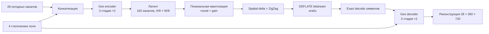

# ERA5 Weather Codec

Компактное представление 28-канального состояния нижней атмосферы ERA5 с
фактическим сжатием не менее `32×`, квантованным латентным представлением и
воспроизводимым encode/decode roundtrip.

Решение реализовано в ноутбуке [`burmalda.ipynb`](burmalda.ipynb) и рассчитано
на запуск в Kaggle с одной NVIDIA GPU.

## Задача

Модель совместно кодирует 28 метеорологических полей на глобальной сетке
`0.5°`, то есть `360 × 720`:

- приземные поля: `t2m`, `mslp`, `u10`, `v10`, `tp6h`, `sst`, `tcwv`, `tcc`;
- температура: `T1000`, `T925`, `T850`, `T700`;
- зональный ветер: `U1000`, `U925`, `U850`, `U700`;
- меридиональный ветер: `V1000`, `V925`, `V850`, `V700`;
- геопотенциал: `Z1000`, `Z925`, `Z850`, `Z700`;
- удельная влажность: `Q1000`, `Q925`, `Q850`, `Q700`.

Для одного временного среза исходный объём считается как размер
`float32`-тензора:

```text
28 × 360 × 720 × 32 бит
```

Фактический compression ratio определяется по полному сериализованному
bitstream, включая его заголовок:

```text
compression_ratio = original_bits / bitstream_bits
```

## Основная идея

Решение использует один свёрточный автоэнкодер для всех 28 каналов. Модель
получает метеорологические и статические поля, строит пространственный латент,
квантует его и сохраняет целочисленные символы в настоящий `.era5c` bitstream.



### Географически корректные свёртки

`GeoConv2d` учитывает геометрию глобальной сетки:

- по долготе используется циклическое дополнение;
- по широте — отражающее дополнение.

Это устраняет искусственный разрыв на границе `0°/360°` и уменьшает краевые
артефакты около полюсов.

### Энкодер и декодер

Энкодер состоит из трёх стадий с шагом 2 и каналами:

```text
32 входных канала → 112 → 144 → 192
```

Каждая стадия содержит residual-блоки с:

- `GroupNorm`;
- depthwise-свёрткой `5 × 5`;
- pointwise-свёртками;
- активацией `SiLU`;
- обучаемым масштабом residual-ветви.

В bottleneck используются два residual-блока и `Squeeze-and-Excitation`.
Декодер последовательно восстанавливает разрешение билинейной интерполяцией и
свёртками. После основной reconstruction head применяется небольшая residual
refinement-сеть.

Четыре статических поля поступают не только на вход энкодера, но и через слабый
обучаемый gate добавляются непосредственно в латент перед декодированием.

### Квантизация

Для каждого латентного канала обучается собственный положительный масштаб.
Целочисленные символы вычисляются как

```text
symbols = round(latent / channel_scale × gain)
```

Во время обучения используется straight-through estimator, а при валидации и
инференсе — обычное округление. Параметр `gain` управляет компромиссом:

- больший `gain` даёт более точную квантизацию и больший bitstream;
- меньший `gain` усиливает сжатие, но увеличивает ошибку реконструкции.

### Формат bitstream

Перед сжатием к символам применяются пространственные delta-преобразования и
ZigZag-кодирование в `uint32`. После этого массив сжимается `zlib/DEFLATE`
уровня 9.

Заголовок bitstream хранит:

- версию формата;
- форму массива;
- значение `gain`;
- параметры entropy coder;
- SHA-256 исходных целочисленных символов.

При декодировании хеш проверяется повторно. Поэтому `exact roundtrip` означает
побитовое совпадение латентных целочисленных символов до и после
сериализации — не идентичность восстановленного поля исходному полю.

## Данные

Ноутбук ожидает уже подготовленный Kaggle Dataset или Notebook Output со
следующей структурой:

```text
train.npy
val.npy
test.npy
train_pairs.npy
val_pairs.npy
static.npy
stats.npz
manifest.json
```

Контракт данных:

| Файл | Ожидаемая структура |
|---|---|
| `train.npy` | `float16`, `[N, 28, 360, 720]` |
| `val.npy` | `float16`, `[N_val, 28, 360, 720]` |
| `test.npy` | `float16`, `[N_test, 28, 360, 720]` |
| `static.npy` | `float32`, `[4, 360, 720]` |
| `train_pairs.npy` | пары индексов для прогноза `+6 ч` |
| `val_pairs.npy` | validation-пары для прогноза `+6 ч` |
| `stats.npz` | mean, std, physical std, квантили, координаты и ocean mask |
| `manifest.json` | временные метки и метаданные подготовки |

Допустимые размеры обучающей выборки:

```text
N ∈ {128, 256, 512, 1024, 2048, 4096, 8192}
```

В ноутбуке проверяется временное разделение:

- train: 2014–2019;
- validation: 2020;
- test: 2021.

Test используется только после выбора checkpoint и калибровки `gain` на
validation.

## Обучение

Модель обучается на случайных патчах `160 × 160`. Вырезание по долготе
циклическое, что позволяет корректно обучаться на патчах, пересекающих
антимеридиан.

Основная функция потерь:

```text
L = L_reconstruction
  + 0.015 × L_gradient
  + 0.080 × L_precipitation
  + 0.010 × L_occupancy
```

Где:

- `L_reconstruction` — latitude-weighted MSE с равным вкладом групп
  surface и pressure;
- для `sst` ошибка считается только по океанской маске;
- `L_gradient` сохраняет пространственные градиенты;
- `L_precipitation` усиливает вклад интенсивных осадков;
- `L_occupancy` не позволяет латенту преждевременно схлопнуться в нули.

Обучение проходит в несколько режимов:

1. первые 2000 шагов — reconstruction warm-up с `gain=8`;
2. основная стадия — целевая квантизация с `gain=40`;
3. каждый десятый шаг — quality anchor с более высоким `gain=50`.

Параметры по умолчанию:

| Параметр | Значение |
|---|---:|
| Optimizer | AdamW |
| Learning rate | `2e-4` |
| Weight decay | `1e-4` |
| LR warm-up | 600 шагов |
| Gradient clipping | `0.75` |
| Validation interval | 500 шагов |
| Early-stopping patience | 14 проверок |
| P100 batch / max steps | 2 / 12000 |
| T4 batch / max steps | 4 / 16000 |

Включены mixed precision, TF32 и cuDNN benchmark. Архитектура дополнительно
проверяется на соответствие ограничению менее 20 млн параметров.

## Калибровка 32×

После обучения `gain` подбирается только на validation:

1. оцениваются четыре validation-кадра;
2. строится геометрическая сетка значений `gain`;
3. находится допустимый интервал;
4. выполняются восемь шагов бисекции;
5. выбирается точка, у которой минимальный CR по calibration-кадрам не ниже
   `32 × 1.035`.

Запас `3.5%` нужен, чтобы единичные более сложные test-кадры не опустили
фактическое сжатие ниже `32×`.

## Метрики

Все пространственные метрики взвешиваются по широте. Для `sst` дополнительно
используется ocean mask.

Основные показатели:

- общий NRMSE:

  ```text
  S_all = 0.5 × S_surface + 0.5 × S_pressure
  ```

- NRMSE каждого физического поля, нормированный на его train-only standard
  deviation;
- средний PSNR;
- spectral error по сферическим гармоникам до `lmax=40`;
- RMSE давления на уровне моря;
- RMSE шестичасовых осадков;
- RMSE скорости ветра на 10 м;
- RMSE высоты `Z700`;
- precision, recall и F1 экстремальных осадков;
- фактический compression ratio;
- exact latent roundtrip.

Ноутбук также строит paired bootstrap 95% CI относительно постоянного
климатологического baseline, сформированного из переданных ERA5 mean/std.
Это сравнение не использует VAEformer.

| Критерий | Порог |
|---|---:|
| Upper 95% CI общего NRMSE | `≤ +3%` |
| Upper 95% CI surface/pressure score | `≤ +5%` |
| Худшее отдельное поле | `≤ +7%` |
| Lower 95% CI разности PSNR | `≥ −0.25 dB` |
| Upper 95% CI ухудшения спектра | `≤ +5%` |
| Фактический CR | `≥ 32×` |
| Exact roundtrip | обязательно |

Дополнительный latent forecast probe проверяет, сохраняет ли представление
информацию, необходимую для прогноза на `+6 ч`. Для официальной проверки нужны
1024 валидные пары; при `N=128` этот тест может быть корректно отмечен как
`not_evaluable`.

## Запуск на Kaggle

1. Создайте Kaggle Notebook и загрузите `burmalda.ipynb`.
2. Включите один GPU: `P100` или `T4`.
3. Подключите подготовленный dataset через **Add Input**.
4. При первом запуске на P100 включите Internet: ноутбук при необходимости
   установит совместимую сборку PyTorch с поддержкой `sm_60`.
5. Выберите режим в `CFG.run_mode`:

   ```python
   run_mode = "AUTO"       # загрузить совместимый checkpoint или обучить
   run_mode = "TRAIN"      # всегда обучать заново
   run_mode = "INFERENCE"  # только загрузить checkpoint
   ```

6. Выполните **Run All** с первой ячейки.

Ноутбук намеренно проверяет, что PyTorch не был импортирован до GPU bootstrap.
Если первая ячейка сообщает об этом, перезапустите Kaggle session и снова
запустите все ячейки с начала.

## Результаты

Рабочая директория:

```text
/kaggle/working/era5_tz_codec/
```

Главные артефакты:

```text
outputs/weather_codec_best.pt
outputs/selected_rates.json
outputs/quality_bitrate_curve.csv
outputs/final_metrics.json
outputs/codec_32x/metrics.json
outputs/codec_32x/per_frame_metrics.csv
outputs/test_natural_std_criteria.json
outputs/noninferiority_vs_natural_std.json
outputs/tz_test_score.json
outputs/tz_test_score.csv
outputs/compliance.json
outputs/probe/probe_metrics.json
outputs/resources.json
era5_tz_submission.zip
```

Главный итоговый показатель находится в:

```text
outputs/tz_test_score.json
```

Поле `primary_test_score_s_all` содержит test `S_all`; меньше — лучше.
Фактический CR и результат exact roundtrip находятся в `final_metrics.json`,
`codec_32x/metrics.json` и `compliance.json`.

Ноутбук `burmalda.ipynb` не содержит сохранённых outputs выполненного запуска,
поэтому численные результаты в этот README намеренно не внесены. Их следует
добавлять только из артефактов завершённого Kaggle-run.

## Ограничения решения

- Реализована одна рабочая точка `32×`; отдельной `64×` точки нет.
- Этот ноутбук соответствует эксперименту на сетке `0.5°`. Для `0.25°`
  требуется отдельный подготовленный dataset и самостоятельный запуск.
- DEFLATE даёт настоящий воспроизводимый bitstream, но не является обучаемой
  entropy-моделью или hyperprior.
- Качество calibration оценивается только на четырёх validation-кадрах, поэтому
  используется safety margin.
- Для полного latent forecast probe требуется не менее 1024 корректных
  шестичасовых пар.

## Воспроизводимость и ограничения вычислений

Решение фиксирует random seed и сохраняет конфигурацию, checkpoint, журналы,
метрики и параметры выбранной рабочей точки. В `compliance.json` проверяются:

- одна GPU;
- не более 24 GiB peak VRAM;
- не более 20 млн параметров;
- не более 50 000 optimizer steps;
- не более 48 GPU-hours;
- допустимое значение `N`;
- порядок 28 каналов;
- временные split;
- фактический bitstream и exact roundtrip.

Полный архив для передачи результатов создаётся автоматически:

```text
/kaggle/working/era5_tz_codec/era5_tz_submission.zip
```
